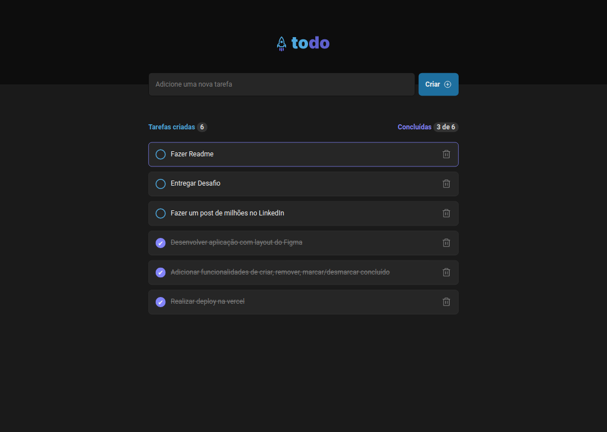
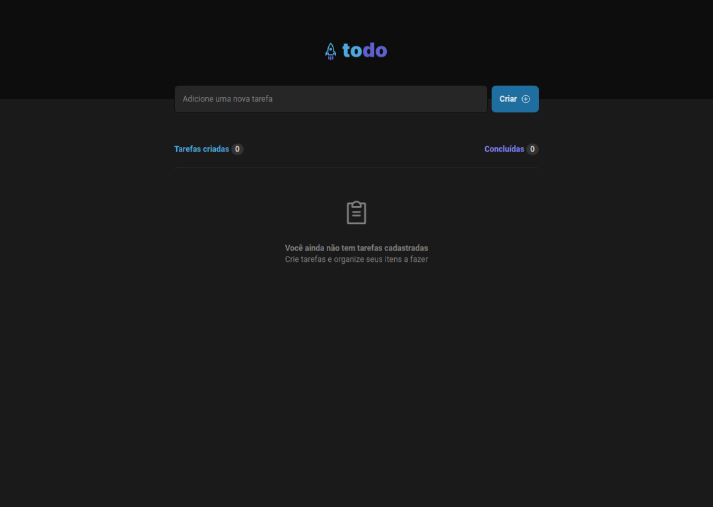

<h2 align="center">
   Ignite Todo List | 
</h2>

<p align="center">


</p>

<p align="center">
  <a href="#-projeto">Projeto</a>&nbsp;&nbsp;&nbsp;|&nbsp;&nbsp;&nbsp;
  <a href="#-como-rodar-o-projeto">Como rodar o projeto</a>&nbsp;&nbsp;&nbsp;|&nbsp;&nbsp;&nbsp;
  <a href="#-tecnologias">Tecnologias</a>&nbsp;&nbsp;&nbsp;|&nbsp;&nbsp;&nbsp;
  <a href="#-Layout">Layout</a>&nbsp;&nbsp;&nbsp;|&nbsp;&nbsp;&nbsp;
  <a href="#-licença">Licença</a>
</p>

## 💻 Projeto

Este projeto foi um dos desafios da Trilha ReactJS. Nesse desafio, foi desenvolvido uma aplicação de controle de tarefas no estilo **to-do list**, que contém as seguintes funcionalidades:

- [x] Adicionar uma nova tarefa
- [x] Marcar e desmarcar uma tarefa como concluída
- [x] Remover uma tarefa da listagem
- [x] Mostrar o progresso de conclusão das tarefas

Projeto foi hospedado na Vercel. Acesse o **Ignite Timer** desenvolvido [clicando aqui](https://ignite-todo-list-vitorsemidio-dev.vercel.app/).

### 📸 Imagens

**Lista Preenchida**


**Lista Vazia**



## 🧭 Como rodar o projeto

**Clone este repositório**

```bash
git clone https://github.com/vitorsemidio-dev/ignite-todo-list.git
```

**Acesse a pasta**

```bash
cd ignite-todo-list
```

**Instale as dependências**

```bash
npm install
```

**Execute a aplicação**

```bash
npm run dev
```

## 🚀 Tecnologias

Esse projeto foi desenvolvido com as seguintes tecnologias:

- [ReactJS](https://pt-br.reactjs.org/)
- [TypeScript](https://www.typescriptlang.org/pt/)
- [Vite](https://vitejs.dev/)

## 🔖 Layout

Você pode visualizar o layout do projeto através [desse link](https://www.figma.com/file/0n0zDN7zbzhRbaEO74Xesx/ToDo-List). É necessário ter conta no [Figma](https://figma.com) para acessá-lo.


## 📝 Licença

Esse projeto está sob a licença MIT. Veja o arquivo [LICENSE](LICENSE) para mais detalhes.
